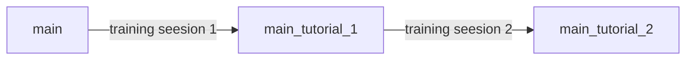

# Arrk-Code.Run

## Welcome to Arrk R&D Training Session

Here, you can find the training support, useful links and contact persons for our lessons. 

## Quick Link for installations

[Create and Manage virtual devices](https://developer.android.com/studio/run/managing-avds)

[How to install Flutter on Windows](https://www.liquidweb.com/kb/how-to-install-and-configure-flutter-sdk-windows-10/)

## How to use this repo

1. Fork this repository to create a remote copy

2. Discover and play round Android Studio and keep an eye on the instructions 

## Project Structure

| Branch Name| Project |
| ------ | ------ |
| main | Project Skeleton |
| main_tutorial_1 | Project after training session 1 |
| main_tutorial_2  | Project after training session 2 |


Development flow chart




> **Note1:** You may need to fork / download the new repository in order to have the new branches on you account / computer

> **Note2:** You can use the following git commands to access other branches
>
>```sh
>git checkout main_tutorial_1
>```
>
>or
>
>```sh
>git checkout main_tutorial_2
>```

# Resources

[Training Support](https://github.com/carinaArrk/CodeRunResources/tree/main/01_Training#welcome-to-arrk-rd-training-session-materials)

[Further Learning](https://github.com/carinaArrk/CodeRunResources/tree/main/02_Further%20Learning#welcome-to-arrk-rd-further-learning-proposals)


# Choose your challenge

[EASY](https://github.com/carinaArrk/CodeRunResources/tree/main/03_Challenge/Easy#problem-statement---easy)

[HARD](https://github.com/carinaArrk/CodeRunResources/tree/main/03_Challenge/Hard#problem-statement---hard)


## Contacts

Ede K. : ede-hunor.kertesz@arrk-engineering.com

Carina C. : carina.camara@arrk-engineering.com

Flavius B. : flavius-alexandru.banc@arrk-engineering.com

Mihai C. : mihai.costea@arrk-engineering.com


**See you at the challenges!**
